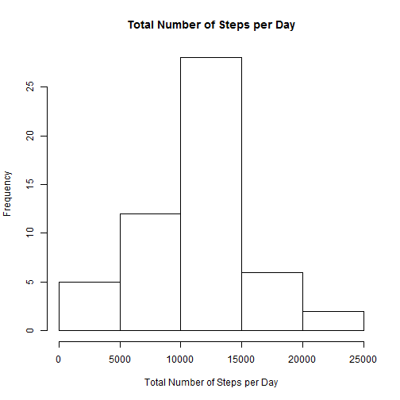
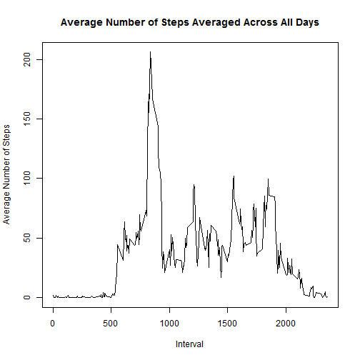
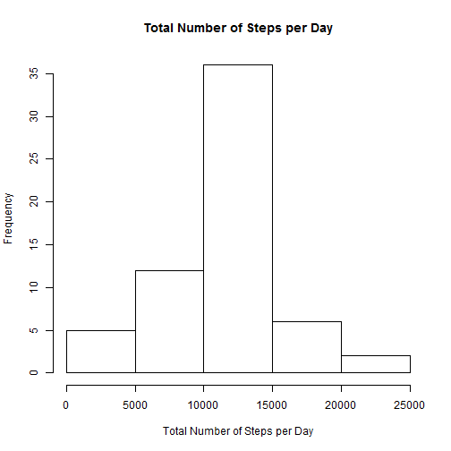

# Reproducible Research: Peer Assessment 1

## Loading and preprocssing the data

Load the data (i.e. `read.csv()`):


```r
# read in the data
data <- read.csv(unzip("activity.zip", "activity.csv"),
                     stringsAsFactors = FALSE)
```

Process/transform the data (if necessary) into a format suitable for your analysis:


```r
# convert the date column from a character to Date class
data$date <- as.Date(data$date, format = "%Y-%m-%d")
```

## What is mean total number of steps taken per day?

Make a histogram of the total number of steps taken each day:


```r
# calculate the total number of steps taken per day
steps_per_day = aggregate(formula = steps ~ date, FUN = sum, data = data, na.rm = TRUE)

hist(steps_per_day$steps,
     xlab = "Total Number of Steps per Day",
     main = "Total Number of Steps per Day")
```

 

Calculate and report the mean and median total number of steps taken per day:


```r
print(mean(steps_per_day$steps))
```

```
## [1] 10766
```


```r
print(median(steps_per_day$steps))
```

```
## [1] 10765
```

## What is the average daily activity pattern?

Make a time series plot (i.e. `type = "l"`) of the 5-minute interval (x-axis) and the average number of steps taken, averaged across all days (y-axis)


```r
# calculate the total number of steps each day
steps_per_interval = aggregate(formula = steps ~ interval, FUN = mean, data = data, na.rm = TRUE)
# plot the average number of steps taken averaged across all days
plot(steps_per_interval$interval, steps_per_interval$steps,
    xlab = "Interval", ylab = "Average Number of Steps",
    main = "Average Number of Steps Averaged Across All Days",
    type = "l")
```

 

Which 5-minute interval, on average across all the days in the dataset, contains the maximum number of steps?


```r
steps_per_interval$interval[which(steps_per_interval$step == max(steps_per_interval$step))] 
```

```
## [1] 835
```

## Imputing missing values

Calculate and report the total number of missing values in the dataset (i.e. the total number of rows with `NA`s)


```r
sum(!complete.cases(data))
```

```
## [1] 2304
```

Devise a strategy for filling in all of the missing values in the dataset. The strategy does not need to be sophisticated. For example, you could use the mean/median for that day, or the mean for that 5-minute interval, etc.

Create a new dataset that is equal to the original dataset but with the missing data filled in.


```r
# replace the NA values in each interval with the mean of that interval
imputed_data <- do.call("rbind", as.list(by(data, data$interval, function(x) { 
                    x$steps[is.na(x$steps)] <- mean(x$steps, na.rm = TRUE); return(x) })))
```

Make a histogram of the total number of steps taken each day and Calculate and report the mean and median total number of steps taken per day. Do these values differ from the estimates from the first part of the assignment? What is the impact of imputing missing data on the estimates of the total daily number of steps?


```r
# calculate the total number of steps each day
imputed_steps_per_day = aggregate(formula = steps ~ date, FUN = sum, data = imputed_data, na.rm = TRUE)
# histogram of the imputed steps per day
hist(imputed_steps_per_day$steps,
     xlab = "Total Number of Steps per Day",
     main = "Total Number of Steps per Day")
```

 

```r
# mean and median of the imputed steps per day
print(mean(imputed_steps_per_day$steps))
```

```
## [1] 10766
```

```r
print(median(imputed_steps_per_day$steps))
```

```
## [1] 10766
```

By imputing the missing data using the average number of steps in the interval the mean total number of steps taken per day has not changed and the median total number of steps taken per day has increased (slightly) to equal the mean total number of steps taken per day.  In addition, the frequency of days with approximately the mean total number of steps has increased.

## Are there differences in activity patterns between weekdays and weekends?

Create a new factor variable in the dataset with two levels - "weekday" and "weekend" indicating whether a given date is a weekday or weekend day.


```r
imputed_data$weekday <- factor(x      = weekdays(imputed_data$date) %in% c("Saturday", "Sunday"), 
                               levels = c(FALSE, TRUE), 
                               labels = c("weekday", "weekend"))
```

Make a panel plot containing a time series plot (i.e. ```type = "l"```) of the 5-minute interval (x-axis) and the average number of steps taken, averaged across all weekday days or weekend days (y-axis). See the README file in the GitHub repository to see an example of what this plot should look like using simulated data.


```r
# create a plot with two subplots
par(mfrow = c(2, 1))
# plot the average number of steps taken averaged across all weekdays and across all weekends
invisible(by(data = imputed_data, INDICES = imputed_data$weekday, FUN = function(x) {
    imputed_steps_per_interval = aggregate(formula = steps ~ interval, FUN = mean, data = x, na.rm = TRUE)
    plot(imputed_steps_per_interval$interval, imputed_steps_per_interval$steps,
        xlab = "Interval", ylab = "Average Number of Steps",
        main = paste("Average Number of Steps Averaged Across All ", unique(x$weekday), "s", sep = ""),
        type = "l")
    } ))
```

 
